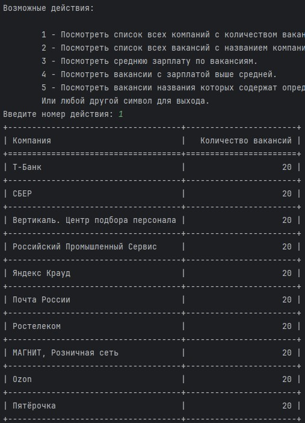
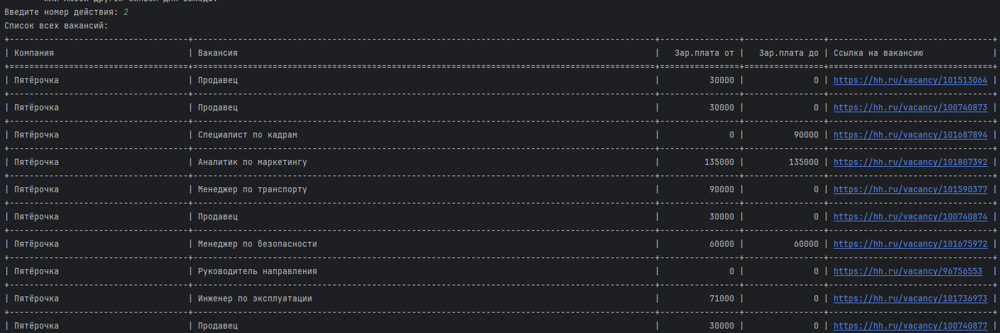
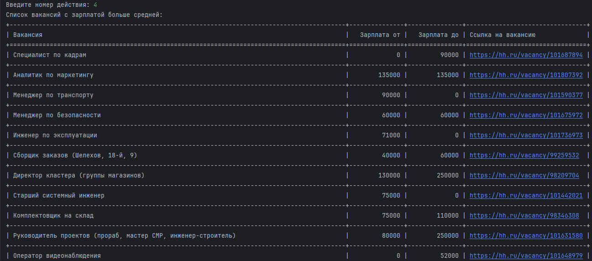
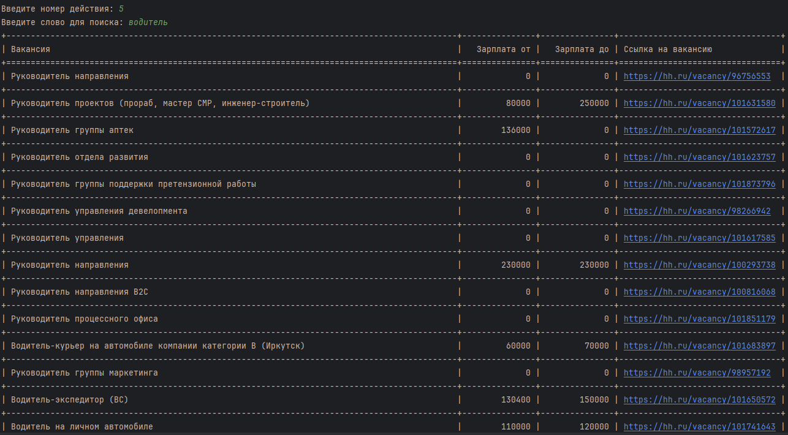

<div align="center">
    <h1>Search for vacancies</h1> 
    <p>
    Это консольное приложение которое умеет получать информацию о вакансиях с платформы hh.ru и сохранять её в базу данных.
    </p>
</div>

## Описание
При каждом запуске программы создаётся база данных `PostgreSQL` под названием `course_work`. Содержит две таблицы `employers` и `vacancies` в которые записывается информация о 10 компаниях имеющих наибольшее количество вакансий на данный момент (в базу сохраняется до 20 вакансий каждой компании).

## Меню пользователя

### 1: Посмотреть список всех компаний с количеством вакансий
Выведет на экран информацию по количеству сохранённых в базе вакансий по компаниям.

Пример вывода:



### 2: Посмотреть список всех вакансий с названием компании, зарплаты и ссылкой
Выведет все вакансии.

Пример:


### 3: Посмотреть среднюю зарплату по вакансиям.
Выведет среднюю зарплату по всем сохранённым вакансиям.


### 4: Посмотреть вакансии с зарплатой выше средней.
Покажет вакансии у которых зарплата выше средней из сохранённых


### 5: Посмотреть вакансии названия которых содержат определённые слова.
Выведет вакансии (если они есть) содержащие в названии искомые подстроки


### любой другой символ - выход из программы
окончание работы программы
___

<div align="center">
    <h3 align="center">
        <p>Использовались языки и инструменты:</p>
        <div>
            &nbsp;
        </div>
    </h3>
</div>

___

## Локальная установка приложения
1. Склонируйте репозиторий:
```bash
git clone https://github.com/Iv-EN/course_work_5.git
```
2.  Создайте и активируйте виртуальное пространство:
```bash
python3 -m venv venv
```
```bash
sourse venv/bin/activate
```
3. Обновите pip и установите зависимости:
```bash
python3 -m pip install --upgrade pip
```
```bash
pip install -r requirements.txt
```
4. Необходимо заполнить секцию `[postgresql]` файла `database.ini`, указав свои данные. Например:
```editorconfig
[postgresql]
USER = postgres
PASSWORD = 12345
HOST = localhost
PORT = 5432
```
4. Запустите приложение из корневой папки
```bash
python3 main.py
```
___

<h3 align="center">
    <p>Автор: Евгений Иванов. </p>
</h3>
<p align="center">

 <div align="center"  class="icons-social" style="margin-left: 10px;">
        <a href="https://vk.com/engenivanov" target="blank" rel="noopener noreferrer">
      
    </a>
    <a href="https://t.me/IvENauto" target="blank" rel="noopener noreferrer">
    
    </a>
  </div>
</p>